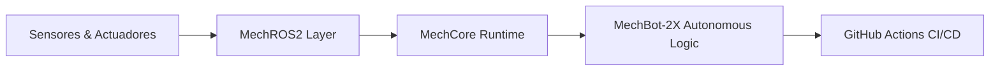

# ¡Hola Mundo! 👋 Soy **él Min** 🤖⚡

  

## 🔧 **Tecnologías & Pasiones**

Desarrollo soluciones avanzadas de software y sistemas embebidos combinando ingeniería de control, robótica autónoma e inteligencia artificial. Mis pilares tecnológicos son:

- 🦀 **Rust**: Programación de sistemas de alto rendimiento, seguros y sin recolector de basura (GC).
- 🤖 **Robótica**: Arquitecturas distribuidas con ROS2 y desarrollo del sistema autónomo **MechBot-2X**.
- 🧠 **IA / ML**: Procesamiento inteligente, modelos predictivos y sistemas cognitivos aplicados a la automatización.
- ☕ **Café > `;`**: Sobreviviendo con elegancia a los segmentos de memoria y errores de compilación.

---

## 🚀 **Ecosistema de Proyectos**

El repositorio se organiza como un workspace modular de Rust y ROS2, diseñado para escalar flujos de trabajo robóticos complejos:

| Módulo / Proyecto | Descripción | Enlace |
| :--- | :--- | :--- |
| **MechBot-2X** | Proyecto estrella de robótica móvil y control de hardware de nueva generación. | [Ver Proyecto](./projects/rust/mechbot-2x) |
| **MechCore** | Núcleo del sistema operativo robótico, gestión de estados y modo turbo. | [Ver Proyecto](./projects/mechcore) |
| **MechROS2** | Capa de integración asíncrona con ROS2 Humble para sensores y actuadores. | [Ver Proyecto](./projects/mechros2) |

---

## 🏗️ **Arquitectura del Sistema**

---

## 📊 **Estadísticas & Actividad**

[![Estadísticas de él Min](https://github-readme-stats.vercel.app/api?username=mechmind-dwvhttps://github-readme-stats.vercel.app/api?username=mechmind-dwvhttps://github-readme-stats.vercel.app/api?username=mechmind-dwvhttps://github-readme-stats.vercel.app/api?username=mechmind-dwv&show_icons=true&theme=radical&hide_border=true&include_all_commits=true&count_private=true&custom_title=Stats+de+MechMind&title_color=FF00FF&icon_color=58A6FF&bg_color=0D1117show_icons=truehttps://github-readme-stats.vercel.app/api?username=mechmind-dwv&show_icons=true&theme=radical&hide_border=true&include_all_commits=true&count_private=true&custom_title=Stats+de+MechMind&title_color=FF00FF&icon_color=58A6FF&bg_color=0D1117theme=radicalhttps://github-readme-stats.vercel.app/api?username=mechmind-dwv&show_icons=true&theme=radical&hide_border=true&include_all_commits=true&count_private=true&custom_title=Stats+de+MechMind&title_color=FF00FF&icon_color=58A6FF&bg_color=0D1117hide_border=truehttps://github-readme-stats.vercel.app/api?username=mechmind-dwv&show_icons=true&theme=radical&hide_border=true&include_all_commits=true&count_private=true&custom_title=Stats+de+MechMind&title_color=FF00FF&icon_color=58A6FF&bg_color=0D1117include_all_commits=truehttps://github-readme-stats.vercel.app/api?username=mechmind-dwv&show_icons=true&theme=radical&hide_border=true&include_all_commits=true&count_private=true&custom_title=Stats+de+MechMind&title_color=FF00FF&icon_color=58A6FF&bg_color=0D1117count_private=trueshow_icons=truehttps://github-readme-stats.vercel.app/api?username=mechmind-dwvhttps://github-readme-stats.vercel.app/api?username=mechmind-dwv&show_icons=true&theme=radical&hide_border=true&include_all_commits=true&count_private=true&custom_title=Stats+de+MechMind&title_color=FF00FF&icon_color=58A6FF&bg_color=0D1117show_icons=truehttps://github-readme-stats.vercel.app/api?username=mechmind-dwv&show_icons=true&theme=radical&hide_border=true&include_all_commits=true&count_private=true&custom_title=Stats+de+MechMind&title_color=FF00FF&icon_color=58A6FF&bg_color=0D1117theme=radicalhttps://github-readme-stats.vercel.app/api?username=mechmind-dwv&show_icons=true&theme=radical&hide_border=true&include_all_commits=true&count_private=true&custom_title=Stats+de+MechMind&title_color=FF00FF&icon_color=58A6FF&bg_color=0D1117hide_border=truehttps://github-readme-stats.vercel.app/api?username=mechmind-dwv&show_icons=true&theme=radical&hide_border=true&include_all_commits=true&count_private=true&custom_title=Stats+de+MechMind&title_color=FF00FF&icon_color=58A6FF&bg_color=0D1117include_all_commits=truehttps://github-readme-stats.vercel.app/api?username=mechmind-dwv&show_icons=true&theme=radical&hide_border=true&include_all_commits=true&count_private=true&custom_title=Stats+de+MechMind&title_color=FF00FF&icon_color=58A6FF&bg_color=0D1117count_private=truetheme=radicalhttps://github-readme-stats.vercel.app/api?username=mechmind-dwvhttps://github-readme-stats.vercel.app/api?username=mechmind-dwv&show_icons=true&theme=radical&hide_border=true&include_all_commits=true&count_private=true&custom_title=Stats+de+MechMind&title_color=FF00FF&icon_color=58A6FF&bg_color=0D1117show_icons=truehttps://github-readme-stats.vercel.app/api?username=mechmind-dwv&show_icons=true&theme=radical&hide_border=true&include_all_commits=true&count_private=true&custom_title=Stats+de+MechMind&title_color=FF00FF&icon_color=58A6FF&bg_color=0D1117theme=radicalhttps://github-readme-stats.vercel.app/api?username=mechmind-dwv&show_icons=true&theme=radical&hide_border=true&include_all_commits=true&count_private=true&custom_title=Stats+de+MechMind&title_color=FF00FF&icon_color=58A6FF&bg_color=0D1117hide_border=truehttps://github-readme-stats.vercel.app/api?username=mechmind-dwv&show_icons=true&theme=radical&hide_border=true&include_all_commits=true&count_private=true&custom_title=Stats+de+MechMind&title_color=FF00FF&icon_color=58A6FF&bg_color=0D1117include_all_commits=truehttps://github-readme-stats.vercel.app/api?username=mechmind-dwv&show_icons=true&theme=radical&hide_border=true&include_all_commits=true&count_private=true&custom_title=Stats+de+MechMind&title_color=FF00FF&icon_color=58A6FF&bg_color=0D1117count_private=truehide_border=truehttps://github-readme-stats.vercel.app/api?username=mechmind-dwvhttps://github-readme-stats.vercel.app/api?username=mechmind-dwv&show_icons=true&theme=radical&hide_border=true&include_all_commits=true&count_private=true&custom_title=Stats+de+MechMind&title_color=FF00FF&icon_color=58A6FF&bg_color=0D1117show_icons=truehttps://github-readme-stats.vercel.app/api?username=mechmind-dwv&show_icons=true&theme=radical&hide_border=true&include_all_commits=true&count_private=true&custom_title=Stats+de+MechMind&title_color=FF00FF&icon_color=58A6FF&bg_color=0D1117theme=radicalhttps://github-readme-stats.vercel.app/api?username=mechmind-dwv&show_icons=true&theme=radical&hide_border=true&include_all_commits=true&count_private=true&custom_title=Stats+de+MechMind&title_color=FF00FF&icon_color=58A6FF&bg_color=0D1117hide_border=truehttps://github-readme-stats.vercel.app/api?username=mechmind-dwv&show_icons=true&theme=radical&hide_border=true&include_all_commits=true&count_private=true&custom_title=Stats+de+MechMind&title_color=FF00FF&icon_color=58A6FF&bg_color=0D1117include_all_commits=truehttps://github-readme-stats.vercel.app/api?username=mechmind-dwv&show_icons=true&theme=radical&hide_border=true&include_all_commits=true&count_private=true&custom_title=Stats+de+MechMind&title_color=FF00FF&icon_color=58A6FF&bg_color=0D1117count_private=trueinclude_all_commits=truehttps://github-readme-stats.vercel.app/api?username=mechmind-dwvhttps://github-readme-stats.vercel.app/api?username=mechmind-dwv&show_icons=true&theme=radical&hide_border=true&include_all_commits=true&count_private=true&custom_title=Stats+de+MechMind&title_color=FF00FF&icon_color=58A6FF&bg_color=0D1117show_icons=truehttps://github-readme-stats.vercel.app/api?username=mechmind-dwv&show_icons=true&theme=radical&hide_border=true&include_all_commits=true&count_private=true&custom_title=Stats+de+MechMind&title_color=FF00FF&icon_color=58A6FF&bg_color=0D1117theme=radicalhttps://github-readme-stats.vercel.app/api?username=mechmind-dwv&show_icons=true&theme=radical&hide_border=true&include_all_commits=true&count_private=true&custom_title=Stats+de+MechMind&title_color=FF00FF&icon_color=58A6FF&bg_color=0D1117hide_border=truehttps://github-readme-stats.vercel.app/api?username=mechmind-dwv&show_icons=true&theme=radical&hide_border=true&include_all_commits=true&count_private=true&custom_title=Stats+de+MechMind&title_color=FF00FF&icon_color=58A6FF&bg_color=0D1117include_all_commits=truehttps://github-readme-stats.vercel.app/api?username=mechmind-dwv&show_icons=true&theme=radical&hide_border=true&include_all_commits=true&count_private=true&custom_title=Stats+de+MechMind&title_color=FF00FF&icon_color=58A6FF&bg_color=0D1117count_private=truecount_private=trueshow_icons=truehttps://github-readme-stats.vercel.app/api?username=mechmind-dwvhttps://github-readme-stats.vercel.app/api?username=mechmind-dwvhttps://github-readme-stats.vercel.app/api?username=mechmind-dwv&show_icons=true&theme=radical&hide_border=true&include_all_commits=true&count_private=true&custom_title=Stats+de+MechMind&title_color=FF00FF&icon_color=58A6FF&bg_color=0D1117show_icons=truehttps://github-readme-stats.vercel.app/api?username=mechmind-dwv&show_icons=true&theme=radical&hide_border=true&include_all_commits=true&count_private=true&custom_title=Stats+de+MechMind&title_color=FF00FF&icon_color=58A6FF&bg_color=0D1117theme=radicalhttps://github-readme-stats.vercel.app/api?username=mechmind-dwv&show_icons=true&theme=radical&hide_border=true&include_all_commits=true&count_private=true&custom_title=Stats+de+MechMind&title_color=FF00FF&icon_color=58A6FF&bg_color=0D1117hide_border=truehttps://github-readme-stats.vercel.app/api?username=mechmind-dwv&show_icons=true&theme=radical&hide_border=true&include_all_commits=true&count_private=true&custom_title=Stats+de+MechMind&title_color=FF00FF&icon_color=58A6FF&bg_color=0D1117include_all_commits=truehttps://github-readme-stats.vercel.app/api?username=mechmind-dwv&show_icons=true&theme=radical&hide_border=true&include_all_commits=true&count_private=true&custom_title=Stats+de+MechMind&title_color=FF00FF&icon_color=58A6FF&bg_color=0D1117count_private=trueshow_icons=truehttps://github-readme-stats.vercel.app/api?username=mechmind-dwvhttps://github-readme-stats.vercel.app/api?username=mechmind-dwv&show_icons=true&theme=radical&hide_border=true&include_all_commits=true&count_private=true&custom_title=Stats+de+MechMind&title_color=FF00FF&icon_color=58A6FF&bg_color=0D1117show_icons=truehttps://github-readme-stats.vercel.app/api?username=mechmind-dwv&show_icons=true&theme=radical&hide_border=true&include_all_commits=true&count_private=true&custom_title=Stats+de+MechMind&title_color=FF00FF&icon_color=58A6FF&bg_color=0D1117theme=radicalhttps://github-readme-stats.vercel.app/api?username=mechmind-dwv&show_icons=true&theme=radical&hide_border=true&include_all_commits=true&count_private=true&custom_title=Stats+de+MechMind&title_color=FF00FF&icon_color=58A6FF&bg_color=0D1117hide_border=truehttps://github-readme-stats.vercel.app/api?username=mechmind-dwv&show_icons=true&theme=radical&hide_border=true&include_all_commits=true&count_private=true&custom_title=Stats+de+MechMind&title_color=FF00FF&icon_color=58A6FF&bg_color=0D1117include_all_commits=truehttps://github-readme-stats.vercel.app/api?username=mechmind-dwv&show_icons=true&theme=radical&hide_border=true&include_all_commits=true&count_private=true&custom_title=Stats+de+MechMind&title_color=FF00FF&icon_color=58A6FF&bg_color=0D1117count_private=truetheme=radicalhttps://github-readme-stats.vercel.app/api?username=mechmind-dwvhttps://github-readme-stats.vercel.app/api?username=mechmind-dwv&show_icons=true&theme=radical&hide_border=true&include_all_commits=true&count_private=true&custom_title=Stats+de+MechMind&title_color=FF00FF&icon_color=58A6FF&bg_color=0D1117show_icons=truehttps://github-readme-stats.vercel.app/api?username=mechmind-dwv&show_icons=true&theme=radical&hide_border=true&include_all_commits=true&count_private=true&custom_title=Stats+de+MechMind&title_color=FF00FF&icon_color=58A6FF&bg_color=0D1117theme=radicalhttps://github-readme-stats.vercel.app/api?username=mechmind-dwv&show_icons=true&theme=radical&hide_border=true&include_all_commits=true&count_private=true&custom_title=Stats+de+MechMind&title_color=FF00FF&icon_color=58A6FF&bg_color=0D1117hide_border=truehttps://github-readme-stats.vercel.app/api?username=mechmind-dwv&show_icons=true&theme=radical&hide_border=true&include_all_commits=true&count_private=true&custom_title=Stats+de+MechMind&title_color=FF00FF&icon_color=58A6FF&bg_color=0D1117include_all_commits=truehttps://github-readme-stats.vercel.app/api?username=mechmind-dwv&show_icons=true&theme=radical&hide_border=true&include_all_commits=true&count_private=true&custom_title=Stats+de+MechMind&title_color=FF00FF&icon_color=58A6FF&bg_color=0D1117count_private=truehide_border=truehttps://github-readme-stats.vercel.app/api?username=mechmind-dwvhttps://github-readme-stats.vercel.app/api?username=mechmind-dwv&show_icons=true&theme=radical&hide_border=true&include_all_commits=true&count_private=true&custom_title=Stats+de+MechMind&title_color=FF00FF&icon_color=58A6FF&bg_color=0D1117show_icons=truehttps://github-readme-stats.vercel.app/api?username=mechmind-dwv&show_icons=true&theme=radical&hide_border=true&include_all_commits=true&count_private=true&custom_title=Stats+de+MechMind&title_color=FF00FF&icon_color=58A6FF&bg_color=0D1117theme=radicalhttps://github-readme-stats.vercel.app/api?username=mechmind-dwv&show_icons=true&theme=radical&hide_border=true&include_all_commits=true&count_private=true&custom_title=Stats+de+MechMind&title_color=FF00FF&icon_color=58A6FF&bg_color=0D1117hide_border=truehttps://github-readme-stats.vercel.app/api?username=mechmind-dwv&show_icons=true&theme=radical&hide_border=true&include_all_commits=true&count_private=true&custom_title=Stats+de+MechMind&title_color=FF00FF&icon_color=58A6FF&bg_color=0D1117include_all_commits=truehttps://github-readme-stats.vercel.app/api?username=mechmind-dwv&show_icons=true&theme=radical&hide_border=true&include_all_commits=true&count_private=true&custom_title=Stats+de+MechMind&title_color=FF00FF&icon_color=58A6FF&bg_color=0D1117count_private=trueinclude_all_commits=truehttps://github-readme-stats.vercel.app/api?username=mechmind-dwvhttps://github-readme-stats.vercel.app/api?username=mechmind-dwv&show_icons=true&theme=radical&hide_border=true&include_all_commits=true&count_private=true&custom_title=Stats+de+MechMind&title_color=FF00FF&icon_color=58A6FF&bg_color=0D1117show_icons=truehttps://github-readme-stats.vercel.app/api?username=mechmind-dwv&show_icons=true&theme=radical&hide_border=true&include_all_commits=true&count_private=true&custom_title=Stats+de+MechMind&title_color=FF00FF&icon_color=58A6FF&bg_color=0D1117theme=radicalhttps://github-readme-stats.vercel.app/api?username=mechmind-dwv&show_icons=true&theme=radical&hide_border=true&include_all_commits=true&count_private=true&custom_title=Stats+de+MechMind&title_color=FF00FF&icon_color=58A6FF&bg_color=0D1117hide_border=truehttps://github-readme-stats.vercel.app/api?username=mechmind-dwv&show_icons=true&theme=radical&hide_border=true&include_all_commits=true&count_private=true&custom_title=Stats+de+MechMind&title_color=FF00FF&icon_color=58A6FF&bg_color=0D1117include_all_commits=truehttps://github-readme-stats.vercel.app/api?username=mechmind-dwv&show_icons=true&theme=radical&hide_border=true&include_all_commits=true&count_private=true&custom_title=Stats+de+MechMind&title_color=FF00FF&icon_color=58A6FF&bg_color=0D1117count_private=truecount_private=truetheme=radicalhttps://github-readme-stats.vercel.app/api?username=mechmind-dwvhttps://github-readme-stats.vercel.app/api?username=mechmind-dwvhttps://github-readme-stats.vercel.app/api?username=mechmind-dwv&show_icons=true&theme=radical&hide_border=true&include_all_commits=true&count_private=true&custom_title=Stats+de+MechMind&title_color=FF00FF&icon_color=58A6FF&bg_color=0D1117show_icons=truehttps://github-readme-stats.vercel.app/api?username=mechmind-dwv&show_icons=true&theme=radical&hide_border=true&include_all_commits=true&count_private=true&custom_title=Stats+de+MechMind&title_color=FF00FF&icon_color=58A6FF&bg_color=0D1117theme=radicalhttps://github-readme-stats.vercel.app/api?username=mechmind-dwv&show_icons=true&theme=radical&hide_border=true&include_all_commits=true&count_private=true&custom_title=Stats+de+MechMind&title_color=FF00FF&icon_color=58A6FF&bg_color=0D1117hide_border=truehttps://github-readme-stats.vercel.app/api?username=mechmind-dwv&show_icons=true&theme=radical&hide_border=true&include_all_commits=true&count_private=true&custom_title=Stats+de+MechMind&title_color=FF00FF&icon_color=58A6FF&bg_color=0D1117include_all_commits=truehttps://github-readme-stats.vercel.app/api?username=mechmind-dwv&show_icons=true&theme=radical&hide_border=true&include_all_commits=true&count_private=true&custom_title=Stats+de+MechMind&title_color=FF00FF&icon_color=58A6FF&bg_color=0D1117count_private=trueshow_icons=truehttps://github-readme-stats.vercel.app/api?username=mechmind-dwvhttps://github-readme-stats.vercel.app/api?username=mechmind-dwv&show_icons=true&theme=radical&hide_border=true&include_all_commits=true&count_private=true&custom_title=Stats+de+MechMind&title_color=FF00FF&icon_color=58A6FF&bg_color=0D1117show_icons=truehttps://github-readme-stats.vercel.app/api?username=mechmind-dwv&show_icons=true&theme=radical&hide_border=true&include_all_commits=true&count_private=true&custom_title=Stats+de+MechMind&title_color=FF00FF&icon_color=58A6FF&bg_color=0D1117theme=radicalhttps://github-readme-stats.vercel.app/api?username=mechmind-dwv&show_icons=true&theme=radical&hide_border=true&include_all_commits=true&count_private=true&custom_title=Stats+de+MechMind&title_color=FF00FF&icon_color=58A6FF&bg_color=0D1117hide_border=truehttps://github-readme-stats.vercel.app/api?username=mechmind-dwv&show_icons=true&theme=radical&hide_border=true&include_all_commits=true&count_private=true&custom_title=Stats+de+MechMind&title_color=FF00FF&icon_color=58A6FF&bg_color=0D1117include_all_commits=truehttps://github-readme-stats.vercel.app/api?username=mechmind-dwv&show_icons=true&theme=radical&hide_border=true&include_all_commits=true&count_private=true&custom_title=Stats+de+MechMind&title_color=FF00FF&icon_color=58A6FF&bg_color=0D1117count_private=truetheme=radicalhttps://github-readme-stats.vercel.app/api?username=mechmind-dwvhttps://github-readme-stats.vercel.app/api?username=mechmind-dwv&show_icons=true&theme=radical&hide_border=true&include_all_commits=true&count_private=true&custom_title=Stats+de+MechMind&title_color=FF00FF&icon_color=58A6FF&bg_color=0D1117show_icons=truehttps://github-readme-stats.vercel.app/api?username=mechmind-dwv&show_icons=true&theme=radical&hide_border=true&include_all_commits=true&count_private=true&custom_title=Stats+de+MechMind&title_color=FF00FF&icon_color=58A6FF&bg_color=0D1117theme=radicalhttps://github-readme-stats.vercel.app/api?username=mechmind-dwv&show_icons=true&theme=radical&hide_border=true&include_all_commits=true&count_private=true&custom_title=Stats+de+MechMind&title_color=FF00FF&icon_color=58A6FF&bg_color=0D1117hide_border=truehttps://github-readme-stats.vercel.app/api?username=mechmind-dwv&show_icons=true&theme=radical&hide_border=true&include_all_commits=true&count_private=true&custom_title=Stats+de+MechMind&title_color=FF00FF&icon_color=58A6FF&bg_color=0D1117include_all_commits=truehttps://github-readme-stats.vercel.app/api?username=mechmind-dwv&show_icons=true&theme=radical&hide_border=true&include_all_commits=true&count_private=true&custom_title=Stats+de+MechMind&title_color=FF00FF&icon_color=58A6FF&bg_color=0D1117count_private=truehide_border=truehttps://github-readme-stats.vercel.app/api?username=mechmind-dwvhttps://github-readme-stats.vercel.app/api?username=mechmind-dwv&show_icons=true&theme=radical&hide_border=true&include_all_commits=true&count_private=true&custom_title=Stats+de+MechMind&title_color=FF00FF&icon_color=58A6FF&bg_color=0D1117show_icons=truehttps://github-readme-stats.vercel.app/api?username=mechmind-dwv&show_icons=true&theme=radical&hide_border=true&include_all_commits=true&count_private=true&custom_title=Stats+de+MechMind&title_color=FF00FF&icon_color=58A6FF&bg_color=0D1117theme=radicalhttps://github-readme-stats.vercel.app/api?username=mechmind-dwv&show_icons=true&theme=radical&hide_border=true&include_all_commits=true&count_private=true&custom_title=Stats+de+MechMind&title_color=FF00FF&icon_color=58A6FF&bg_color=0D1117hide_border=truehttps://github-readme-stats.vercel.app/api?username=mechmind-dwv&show_icons=true&theme=radical&hide_border=true&include_all_commits=true&count_private=true&custom_title=Stats+de+MechMind&title_color=FF00FF&icon_color=58A6FF&bg_color=0D1117include_all_commits=truehttps://github-readme-stats.vercel.app/api?username=mechmind-dwv&show_icons=true&theme=radical&hide_border=true&include_all_commits=true&count_private=true&custom_title=Stats+de+MechMind&title_color=FF00FF&icon_color=58A6FF&bg_color=0D1117count_private=trueinclude_all_commits=truehttps://github-readme-stats.vercel.app/api?username=mechmind-dwvhttps://github-readme-stats.vercel.app/api?username=mechmind-dwv&show_icons=true&theme=radical&hide_border=true&include_all_commits=true&count_private=true&custom_title=Stats+de+MechMind&title_color=FF00FF&icon_color=58A6FF&bg_color=0D1117show_icons=truehttps://github-readme-stats.vercel.app/api?username=mechmind-dwv&show_icons=true&theme=radical&hide_border=true&include_all_commits=true&count_private=true&custom_title=Stats+de+MechMind&title_color=FF00FF&icon_color=58A6FF&bg_color=0D1117theme=radicalhttps://github-readme-stats.vercel.app/api?username=mechmind-dwv&show_icons=true&theme=radical&hide_border=true&include_all_commits=true&count_private=true&custom_title=Stats+de+MechMind&title_color=FF00FF&icon_color=58A6FF&bg_color=0D1117hide_border=truehttps://github-readme-stats.vercel.app/api?username=mechmind-dwv&show_icons=true&theme=radical&hide_border=true&include_all_commits=true&count_private=true&custom_title=Stats+de+MechMind&title_color=FF00FF&icon_color=58A6FF&bg_color=0D1117include_all_commits=truehttps://github-readme-stats.vercel.app/api?username=mechmind-dwv&show_icons=true&theme=radical&hide_border=true&include_all_commits=true&count_private=true&custom_title=Stats+de+MechMind&title_color=FF00FF&icon_color=58A6FF&bg_color=0D1117count_private=truecount_private=truehide_border=truehttps://github-readme-stats.vercel.app/api?username=mechmind-dwvhttps://github-readme-stats.vercel.app/api?username=mechmind-dwvhttps://github-readme-stats.vercel.app/api?username=mechmind-dwv&show_icons=true&theme=radical&hide_border=true&include_all_commits=true&count_private=true&custom_title=Stats+de+MechMind&title_color=FF00FF&icon_color=58A6FF&bg_color=0D1117show_icons=truehttps://github-readme-stats.vercel.app/api?username=mechmind-dwv&show_icons=true&theme=radical&hide_border=true&include_all_commits=true&count_private=true&custom_title=Stats+de+MechMind&title_color=FF00FF&icon_color=58A6FF&bg_color=0D1117theme=radicalhttps://github-readme-stats.vercel.app/api?username=mechmind-dwv&show_icons=true&theme=radical&hide_border=true&include_all_commits=true&count_private=true&custom_title=Stats+de+MechMind&title_color=FF00FF&icon_color=58A6FF&bg_color=0D1117hide_border=truehttps://github-readme-stats.vercel.app/api?username=mechmind-dwv&show_icons=true&theme=radical&hide_border=true&include_all_commits=true&count_private=true&custom_title=Stats+de+MechMind&title_color=FF00FF&icon_color=58A6FF&bg_color=0D1117include_all_commits=truehttps://github-readme-stats.vercel.app/api?username=mechmind-dwv&show_icons=true&theme=radical&hide_border=true&include_all_commits=true&count_private=true&custom_title=Stats+de+MechMind&title_color=FF00FF&icon_color=58A6FF&bg_color=0D1117count_private=trueshow_icons=truehttps://github-readme-stats.vercel.app/api?username=mechmind-dwvhttps://github-readme-stats.vercel.app/api?username=mechmind-dwv&show_icons=true&theme=radical&hide_border=true&include_all_commits=true&count_private=true&custom_title=Stats+de+MechMind&title_color=FF00FF&icon_color=58A6FF&bg_color=0D1117show_icons=truehttps://github-readme-stats.vercel.app/api?username=mechmind-dwv&show_icons=true&theme=radical&hide_border=true&include_all_commits=true&count_private=true&custom_title=Stats+de+MechMind&title_color=FF00FF&icon_color=58A6FF&bg_color=0D1117theme=radicalhttps://github-readme-stats.vercel.app/api?username=mechmind-dwv&show_icons=true&theme=radical&hide_border=true&include_all_commits=true&count_private=true&custom_title=Stats+de+MechMind&title_color=FF00FF&icon_color=58A6FF&bg_color=0D1117hide_border=truehttps://github-readme-stats.vercel.app/api?username=mechmind-dwv&show_icons=true&theme=radical&hide_border=true&include_all_commits=true&count_private=true&custom_title=Stats+de+MechMind&title_color=FF00FF&icon_color=58A6FF&bg_color=0D1117include_all_commits=truehttps://github-readme-stats.vercel.app/api?username=mechmind-dwv&show_icons=true&theme=radical&hide_border=true&include_all_commits=true&count_private=true&custom_title=Stats+de+MechMind&title_color=FF00FF&icon_color=58A6FF&bg_color=0D1117count_private=truetheme=radicalhttps://github-readme-stats.vercel.app/api?username=mechmind-dwvhttps://github-readme-stats.vercel.app/api?username=mechmind-dwv&show_icons=true&theme=radical&hide_border=true&include_all_commits=true&count_private=true&custom_title=Stats+de+MechMind&title_color=FF00FF&icon_color=58A6FF&bg_color=0D1117show_icons=truehttps://github-readme-stats.vercel.app/api?username=mechmind-dwv&show_icons=true&theme=radical&hide_border=true&include_all_commits=true&count_private=true&custom_title=Stats+de+MechMind&title_color=FF00FF&icon_color=58A6FF&bg_color=0D1117theme=radicalhttps://github-readme-stats.vercel.app/api?username=mechmind-dwv&show_icons=true&theme=radical&hide_border=true&include_all_commits=true&count_private=true&custom_title=Stats+de+MechMind&title_color=FF00FF&icon_color=58A6FF&bg_color=0D1117hide_border=truehttps://github-readme-stats.vercel.app/api?username=mechmind-dwv&show_icons=true&theme=radical&hide_border=true&include_all_commits=true&count_private=true&custom_title=Stats+de+MechMind&title_color=FF00FF&icon_color=58A6FF&bg_color=0D1117include_all_commits=truehttps://github-readme-stats.vercel.app/api?username=mechmind-dwv&show_icons=true&theme=radical&hide_border=true&include_all_commits=true&count_private=true&custom_title=Stats+de+MechMind&title_color=FF00FF&icon_color=58A6FF&bg_color=0D1117count_private=truehide_border=truehttps://github-readme-stats.vercel.app/api?username=mechmind-dwvhttps://github-readme-stats.vercel.app/api?username=mechmind-dwv&show_icons=true&theme=radical&hide_border=true&include_all_commits=true&count_private=true&custom_title=Stats+de+MechMind&title_color=FF00FF&icon_color=58A6FF&bg_color=0D1117show_icons=truehttps://github-readme-stats.vercel.app/api?username=mechmind-dwv&show_icons=true&theme=radical&hide_border=true&include_all_commits=true&count_private=true&custom_title=Stats+de+MechMind&title_color=FF00FF&icon_color=58A6FF&bg_color=0D1117theme=radicalhttps://github-readme-stats.vercel.app/api?username=mechmind-dwv&show_icons=true&theme=radical&hide_border=true&include_all_commits=true&count_private=true&custom_title=Stats+de+MechMind&title_color=FF00FF&icon_color=58A6FF&bg_color=0D1117hide_border=truehttps://github-readme-stats.vercel.app/api?username=mechmind-dwv&show_icons=true&theme=radical&hide_border=true&include_all_commits=true&count_private=true&custom_title=Stats+de+MechMind&title_color=FF00FF&icon_color=58A6FF&bg_color=0D1117include_all_commits=truehttps://github-readme-stats.vercel.app/api?username=mechmind-dwv&show_icons=true&theme=radical&hide_border=true&include_all_commits=true&count_private=true&custom_title=Stats+de+MechMind&title_color=FF00FF&icon_color=58A6FF&bg_color=0D1117count_private=trueinclude_all_commits=truehttps://github-readme-stats.vercel.app/api?username=mechmind-dwvhttps://github-readme-stats.vercel.app/api?username=mechmind-dwv&show_icons=true&theme=radical&hide_border=true&include_all_commits=true&count_private=true&custom_title=Stats+de+MechMind&title_color=FF00FF&icon_color=58A6FF&bg_color=0D1117show_icons=truehttps://github-readme-stats.vercel.app/api?username=mechmind-dwv&show_icons=true&theme=radical&hide_border=true&include_all_commits=true&count_private=true&custom_title=Stats+de+MechMind&title_color=FF00FF&icon_color=58A6FF&bg_color=0D1117theme=radicalhttps://github-readme-stats.vercel.app/api?username=mechmind-dwv&show_icons=true&theme=radical&hide_border=true&include_all_commits=true&count_private=true&custom_title=Stats+de+MechMind&title_color=FF00FF&icon_color=58A6FF&bg_color=0D1117hide_border=truehttps://github-readme-stats.vercel.app/api?username=mechmind-dwv&show_icons=true&theme=radical&hide_border=true&include_all_commits=true&count_private=true&custom_title=Stats+de+MechMind&title_color=FF00FF&icon_color=58A6FF&bg_color=0D1117include_all_commits=truehttps://github-readme-stats.vercel.app/api?username=mechmind-dwv&show_icons=true&theme=radical&hide_border=true&include_all_commits=true&count_private=true&custom_title=Stats+de+MechMind&title_color=FF00FF&icon_color=58A6FF&bg_color=0D1117count_private=truecount_private=trueinclude_all_commits=truehttps://github-readme-stats.vercel.app/api?username=mechmind-dwvhttps://github-readme-stats.vercel.app/api?username=mechmind-dwvhttps://github-readme-stats.vercel.app/api?username=mechmind-dwv&show_icons=true&theme=radical&hide_border=true&include_all_commits=true&count_private=true&custom_title=Stats+de+MechMind&title_color=FF00FF&icon_color=58A6FF&bg_color=0D1117show_icons=truehttps://github-readme-stats.vercel.app/api?username=mechmind-dwv&show_icons=true&theme=radical&hide_border=true&include_all_commits=true&count_private=true&custom_title=Stats+de+MechMind&title_color=FF00FF&icon_color=58A6FF&bg_color=0D1117theme=radicalhttps://github-readme-stats.vercel.app/api?username=mechmind-dwv&show_icons=true&theme=radical&hide_border=true&include_all_commits=true&count_private=true&custom_title=Stats+de+MechMind&title_color=FF00FF&icon_color=58A6FF&bg_color=0D1117hide_border=truehttps://github-readme-stats.vercel.app/api?username=mechmind-dwv&show_icons=true&theme=radical&hide_border=true&include_all_commits=true&count_private=true&custom_title=Stats+de+MechMind&title_color=FF00FF&icon_color=58A6FF&bg_color=0D1117include_all_commits=truehttps://github-readme-stats.vercel.app/api?username=mechmind-dwv&show_icons=true&theme=radical&hide_border=true&include_all_commits=true&count_private=true&custom_title=Stats+de+MechMind&title_color=FF00FF&icon_color=58A6FF&bg_color=0D1117count_private=trueshow_icons=truehttps://github-readme-stats.vercel.app/api?username=mechmind-dwvhttps://github-readme-stats.vercel.app/api?username=mechmind-dwv&show_icons=true&theme=radical&hide_border=true&include_all_commits=true&count_private=true&custom_title=Stats+de+MechMind&title_color=FF00FF&icon_color=58A6FF&bg_color=0D1117show_icons=truehttps://github-readme-stats.vercel.app/api?username=mechmind-dwv&show_icons=true&theme=radical&hide_border=true&include_all_commits=true&count_private=true&custom_title=Stats+de+MechMind&title_color=FF00FF&icon_color=58A6FF&bg_color=0D1117theme=radicalhttps://github-readme-stats.vercel.app/api?username=mechmind-dwv&show_icons=true&theme=radical&hide_border=true&include_all_commits=true&count_private=true&custom_title=Stats+de+MechMind&title_color=FF00FF&icon_color=58A6FF&bg_color=0D1117hide_border=truehttps://github-readme-stats.vercel.app/api?username=mechmind-dwv&show_icons=true&theme=radical&hide_border=true&include_all_commits=true&count_private=true&custom_title=Stats+de+MechMind&title_color=FF00FF&icon_color=58A6FF&bg_color=0D1117include_all_commits=truehttps://github-readme-stats.vercel.app/api?username=mechmind-dwv&show_icons=true&theme=radical&hide_border=true&include_all_commits=true&count_private=true&custom_title=Stats+de+MechMind&title_color=FF00FF&icon_color=58A6FF&bg_color=0D1117count_private=truetheme=radicalhttps://github-readme-stats.vercel.app/api?username=mechmind-dwvhttps://github-readme-stats.vercel.app/api?username=mechmind-dwv&show_icons=true&theme=radical&hide_border=true&include_all_commits=true&count_private=true&custom_title=Stats+de+MechMind&title_color=FF00FF&icon_color=58A6FF&bg_color=0D1117show_icons=truehttps://github-readme-stats.vercel.app/api?username=mechmind-dwv&show_icons=true&theme=radical&hide_border=true&include_all_commits=true&count_private=true&custom_title=Stats+de+MechMind&title_color=FF00FF&icon_color=58A6FF&bg_color=0D1117theme=radicalhttps://github-readme-stats.vercel.app/api?username=mechmind-dwv&show_icons=true&theme=radical&hide_border=true&include_all_commits=true&count_private=true&custom_title=Stats+de+MechMind&title_color=FF00FF&icon_color=58A6FF&bg_color=0D1117hide_border=truehttps://github-readme-stats.vercel.app/api?username=mechmind-dwv&show_icons=true&theme=radical&hide_border=true&include_all_commits=true&count_private=true&custom_title=Stats+de+MechMind&title_color=FF00FF&icon_color=58A6FF&bg_color=0D1117include_all_commits=truehttps://github-readme-stats.vercel.app/api?username=mechmind-dwv&show_icons=true&theme=radical&hide_border=true&include_all_commits=true&count_private=true&custom_title=Stats+de+MechMind&title_color=FF00FF&icon_color=58A6FF&bg_color=0D1117count_private=truehide_border=truehttps://github-readme-stats.vercel.app/api?username=mechmind-dwvhttps://github-readme-stats.vercel.app/api?username=mechmind-dwv&show_icons=true&theme=radical&hide_border=true&include_all_commits=true&count_private=true&custom_title=Stats+de+MechMind&title_color=FF00FF&icon_color=58A6FF&bg_color=0D1117show_icons=truehttps://github-readme-stats.vercel.app/api?username=mechmind-dwv&show_icons=true&theme=radical&hide_border=true&include_all_commits=true&count_private=true&custom_title=Stats+de+MechMind&title_color=FF00FF&icon_color=58A6FF&bg_color=0D1117theme=radicalhttps://github-readme-stats.vercel.app/api?username=mechmind-dwv&show_icons=true&theme=radical&hide_border=true&include_all_commits=true&count_private=true&custom_title=Stats+de+MechMind&title_color=FF00FF&icon_color=58A6FF&bg_color=0D1117hide_border=truehttps://github-readme-stats.vercel.app/api?username=mechmind-dwv&show_icons=true&theme=radical&hide_border=true&include_all_commits=true&count_private=true&custom_title=Stats+de+MechMind&title_color=FF00FF&icon_color=58A6FF&bg_color=0D1117include_all_commits=truehttps://github-readme-stats.vercel.app/api?username=mechmind-dwv&show_icons=true&theme=radical&hide_border=true&include_all_commits=true&count_private=true&custom_title=Stats+de+MechMind&title_color=FF00FF&icon_color=58A6FF&bg_color=0D1117count_private=trueinclude_all_commits=truehttps://github-readme-stats.vercel.app/api?username=mechmind-dwvhttps://github-readme-stats.vercel.app/api?username=mechmind-dwv&show_icons=true&theme=radical&hide_border=true&include_all_commits=true&count_private=true&custom_title=Stats+de+MechMind&title_color=FF00FF&icon_color=58A6FF&bg_color=0D1117show_icons=truehttps://github-readme-stats.vercel.app/api?username=mechmind-dwv&show_icons=true&theme=radical&hide_border=true&include_all_commits=true&count_private=true&custom_title=Stats+de+MechMind&title_color=FF00FF&icon_color=58A6FF&bg_color=0D1117theme=radicalhttps://github-readme-stats.vercel.app/api?username=mechmind-dwv&show_icons=true&theme=radical&hide_border=true&include_all_commits=true&count_private=true&custom_title=Stats+de+MechMind&title_color=FF00FF&icon_color=58A6FF&bg_color=0D1117hide_border=truehttps://github-readme-stats.vercel.app/api?username=mechmind-dwv&show_icons=true&theme=radical&hide_border=true&include_all_commits=true&count_private=true&custom_title=Stats+de+MechMind&title_color=FF00FF&icon_color=58A6FF&bg_color=0D1117include_all_commits=truehttps://github-readme-stats.vercel.app/api?username=mechmind-dwv&show_icons=true&theme=radical&hide_border=true&include_all_commits=true&count_private=true&custom_title=Stats+de+MechMind&title_color=FF00FF&icon_color=58A6FF&bg_color=0D1117count_private=truecount_private=truecount_private=true)](https://github.com/mechmind-dwv)

> *"Transformando código complejo en movimientos robóticos precisos y eficientes."*

<!-- START_TECH_STACK -->
## 🛠️ Stack Tecnológico Actualizado
- 🦀 **Rust** 1.97.1
- 🤖 **ROS2** Humble Hawksbill
<!-- END_TECH_STACK -->
