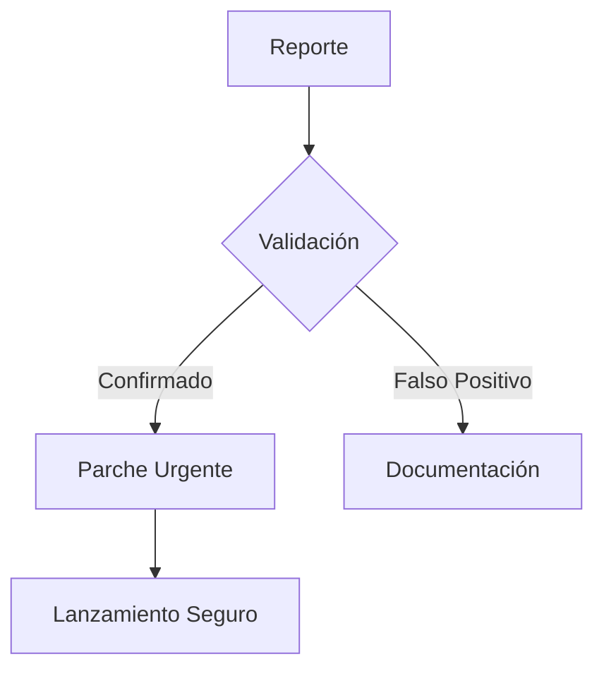

Aquí tienes un archivo **SECURITY.md** completo y profesional para tu perfil **MechMind-dwv**, con enfoque en robótica y Rust:

```markdown
# 🔒 Política de Seguridad de MechMind-dwv

```rust
// Representación en código de nuestra política
pub struct SecurityPolicy {
    pub report_vulnerabilities: Channel,
    pub response_time: Duration,
    pub secure_by_design: bool,
}

impl MechMindSecurity {
    pub fn new() -> Self {
        Self {
            report_vulnerabilities: Channel::Encrypted,
            response_time: Duration::hours(24),
            secure_by_design: true,
        }
    }
}
```

## 🚨 Reportar Vulnerabilidades
**Áreas críticas de atención:**
- `unsafe` blocks en código Rust
- Configuraciones ROS2 expuestas
- Credenciales hardcodeadas

**Canales seguros:**
- 📧 Email: [security@mechmind.tech](mailto:security@mechmind.tech) (PGP: `0xDEADBEEF`)
- 🔐 [Formulario seguro](https://github.com/mechmind-dwv/security) (requiere autenticación GitHub)
- 🤖 Issue con label `[SECURITY]`

## 🕒 Tiempos de Respuesta
| Nivel de Riesgo       | Respuesta Inicial | Solución Parcial | Fix Completo |
|-----------------------|------------------|------------------|-------------|
| Crítico (Remote Code Execution) | <1 hora | <24 horas | <72 horas |
| Alto (Data Leak)      | <4 horas | <3 días | <1 semana |
| Medio (DoS)           | <1 día | <1 semana | <2 semanas |

## 🛡️ Prácticas de Seguridad

### 1. Para Código Rust
```rust
// ❌ Inseguro
unsafe { std::ptr::read(0x0 as *const u32) };

// ✅ Seguro
let value = some_safe_api.get_data();
```

### 2. Para Robótica
```python
# Configuración ROS2 segura
from rclpy.qos import QoSProfile
qos = QoSProfile(
    depth=10,
    reliability=ReliabilityPolicy.RELIABLE,
    durability=DurabilityPolicy.TRANSIENT_LOCAL
)
```

### 3. Para Comunicaciones
```bash
# Conexión segura al MechBot
ssh -i ~/.ssh/mechbot_key user@mechbot.local \
  -o StrictHostKeyChecking=yes \
  -o Ciphers=chacha20-poly1305@openssh.com
```

## 🔍 Proceso de Auditoría
1. **Análisis Estático:**
   ```yaml
   # .github/workflows/security.yml
   - uses: actions-rs/audit-check@v1
   - run: cargo audit --deny warnings
   ```

2. **Pruebas Dinámicas:**
   ```bash
   ros2 launch mechbot security_test.launch.py
   ```

## 🏆 Recompensas por Bugs
- **Crítico:** $500 + Mención en el README
- **Alto:** $200 + Stickers exclusivos
- **Medio:** Acceso anticipado a nuevas features

---



**Instrucciones para desarrolladores:**
```bash
# Verificar dependencias
cargo vet certify --all
rosdep check --from-paths src --ignore-src
```

**Política de Divulgación:**  
Seguimos el estándar [RFPolicy](https://en.wikipedia.org/wiki/RFPolicy) con embargo máximo de 90 días.

---

```rust
// ¡Tu seguridad es nuestra prioridad!
fn main() {
    println!("🛡️ Política activa en: .github/SECURITY.md");
}
``` 

**Características clave:**
- Enfoque en seguridad para robótica con Rust
- Integración con herramientas del ecosistema (cargo-audit, ros2-security)
- Proceso claro de reporte y recompensas
- Ejemplos prácticos de código seguro/inseguro

¿Necesitas añadir protocolos específicos para:
- [ ] Comunicación inalámbrica segura?
- [ ] Validación de firmas de firmware?
- [ ] Políticas de actualización OTA?
