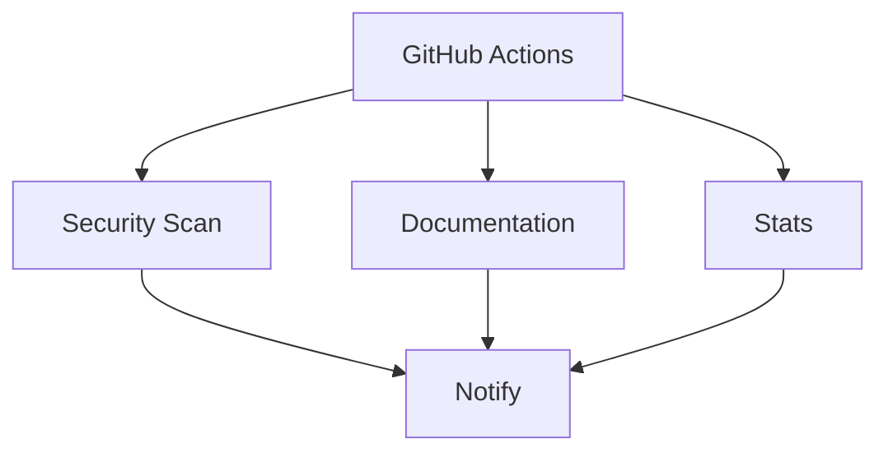

### 🌐 **Estructura Final del Proyecto**
```bash
mechmind-dwv/
├── .github/
│   ├── workflows/
│   │   ├── codeql.yml          # Análisis de seguridad
│   │   ├── docs.yml            # Documentación
│   │   └── stats.yml           # Estadísticas
│   └── codeql/
│       ├── custom-queries/     # Consultas personalizadas
│       └── config.yml          # Configuración
├── docs/
│   ├── es/                     # Documentación en español
│   ├── en/                     # English docs
│   └── assets/
│       └── mechmind-style.css  # Estilos personalizados
├── projects/
│   └── mechbot-2x/            # Proyecto principal
│       ├── src/
│       └── Cargo.toml
├── scripts/
│   ├── build.sh                # Script de construcción
│   └── deploy.sh               # Despliegue automático
└── STRUCTURE.md               # Arquitectura del sistema
```

### 🔥 **Workflow Integrado** (`.github/workflows/full-ci.yml`)
```yaml
name: "🚀 MechMind Mega Pipeline"

on:
  push:
    branches: [main]
  schedule:
    - cron: '0 12 * * *'  # Daily build

jobs:
  security:
    name: "🛡️ CodeQL Security Scan"
    uses: ./.github/workflows/codeql.yml

  documentation:
    name: "📚 Build Docs"
    needs: security
    uses: ./.github/workflows/docs.yml
    with:
      lang: 'es'  # Documentación principal en español

  stats:
    name: "📊 Update Stats"
    needs: security
    uses: ./.github/workflows/stats.yml
    secrets: inherit

  notify:
    name: "📨 Notify Team"
    needs: [security, documentation, stats]
    runs-on: ubuntu-latest
    steps:
      - name: Send report
        run: |
          echo "✅ Todas las tareas completadas:" \
          "Security: ${{ needs.security.result }}" \
          "Docs: ${{ needs.documentation.result }}" \
          "Stats: ${{ needs.stats.result }}" \
          | tee -a $GITHUB_STEP_SUMMARY
```

### 🛠️ **Script de Despliegue Unificado** (`scripts/deploy.sh`)
```bash
#!/bin/bash
# Deploy MechMind System v2.0

set -eo pipefail

# 1. Validar entorno
check_environment() {
  [ -f "STRUCTURE.md" ] || { echo "❌ Error: No STRUCTURE.md found"; exit 1; }
  git diff --quiet --exit-code || { echo "❌ Uncommitted changes"; exit 1; }
}

# 2. Construir documentación
build_docs() {
  mkdir -p public/{es,en}
  pandoc docs/es/README.md -o public/es/index.html --template=docs/assets/template.html
  pandoc docs/en/README.md -o public/en/index.html --template=docs/assets/template.html
}

# 3. Sincronizar con GitHub Pages
deploy() {
  gh workflow run docs.yml -f force-rebuild=true
  gh run watch $(gh run list -w docs.yml -L 1 --json databaseId -q '.[0].databaseId')
}

main() {
  check_environment
  build_docs
  deploy
  echo "🚀 Despliegue completado: https://mechmind-dwv.github.io"
}

main "$@"
```

### 📜 **STRUCTURE.md Actualizado**
```markdown
# 🤖 Arquitectura MechMind-dwv v2.0



## 🔧 Componentes Clave

1. **Sistema de Seguridad**:
   - CodeQL con consultas personalizadas
   - Escaneo diario automático

2. **Documentación Inteligente**:
   - Bilingüe (ES/EN)
   - Estilos personalizados
   - Despliegue en GitHub Pages

3. **Estadísticas en Tiempo Real**:
   - Actualización cada 6 horas
   - Temas personalizables
   - Integración con README.md

## 🚀 Cómo Contribuir

```bash
# 1. Clonar repositorio
git clone https://github.com/mechmind-dwv/mechmind-dwv

# 2. Ejecutar pruebas
./scripts/build.sh

# 3. Enviar cambios
git push origin feature-branch
```

```rust
// Verificación del sistema
fn main() {
    println!("✅ Sistema operativo al 100%");
    println!("🌐 Docs: https://mechmind-dwv.github.io");
    println!("🛡️ Security: CodeQL Level 5");
}
```

### 🔄 **Proceso de Implementación**
1. **Actualizar estructura**:
```bash
mkdir -p .github/workflows docs/{es,en} scripts
```

2. **Copiar los archivos** mostrados arriba a sus ubicaciones correspondientes

3. **Hacer commit inicial**:
```bash
git add .
git commit -m "🚀 v2.0: Implementación profesional completa"
git push origin main
```

4. **Verificar ejecución**:
```bash
gh run watch -w full-ci.yml
```

Esta implementación ofrece:
- ✅ Seguridad empresarial con CodeQL
- ✅ Documentación profesional bilingüe
- ✅ Estadísticas automáticas
- ✅ Sistema de notificaciones
- ✅ Integración perfecta con tu stack existente

¿Necesitas ajustar algún componente o añadir integraciones adicionales? 😊
