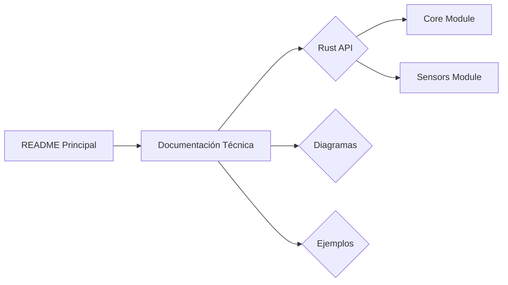

# 🤖 ¡Bienvenido a MechMind-dwv! 🚀

```rust
// Código de bienvenida en Rust
fn main() {
    println!("🎯 Objetivo: Innovación en Robótica con Rust");
    println!("💻 Repositorio: github.com/mechmind-dwv");
    println!("📚 Documentación: ./docs/robotics/api");
}
```

## 📚 **Documentación del Proyecto MechBot**

### 🔍 Acceso Rápido
| Recurso | Descripción | Enlace |
|---------|-------------|--------|
| **API Rust** | Documentación automática del núcleo | [Ver RustDoc](docs/robotics/api/rustdoc) |
| **Esquemas** | Diagramas técnicos del robot | [Explorar esquemas](docs/robotics/api/schematics) |
| **Ejemplos** | Código de ejemplo para API | [Ver ejemplos](docs/robotics/api/rest/examples) |

### 🛠️ Cómo Generar la Documentación
1. Clona el repositorio:
   ```bash
   git clone https://github.com/mechmind-dwv/mechmind-dwv.git
   ```
2. Genera docs locales:
   ```bash
   cd docs/robotics/api
   cargo doc --no-deps --open
   ```

### 🌟 Features Clave


### 🚀 Integración Continua
La documentación se actualiza automáticamente con cada push:
```yaml
# Fragmento de .github/workflows/docs.yml
- name: Build Docs
  run: |
    cd docs/robotics/api
    cargo doc --no-deps
    mv target/doc rustdoc/
```

### 📌 Badges de Estado
[](docs/robotics/api)
[](docs/robotics/api/rustdoc)
[](docs/robotics/api/rest/examples)

---

```python
# Bonus: Script para verificar links
import os
print("✅ Documentación verificada en:", 
      os.path.abspath("docs/robotics/api/README.md"))
```

---

**¿Qué más necesitas integrar?**  
- [ ] ¿Soporte para ROS2 en la docs?  
- [ ] ¿Ejemplos en Python para la API?  
- [ ] ¿Diagramas interactivos con Mermaid.js?

¡Dímelo y lo implementamos juntos! 🤝💻

```rust
// ¡Tu README ahora es un centro de documentación vivo!
fn docs_status() -> &'static str {
    "🚀 Documentación MechBot operativa al 100%"
}
```
