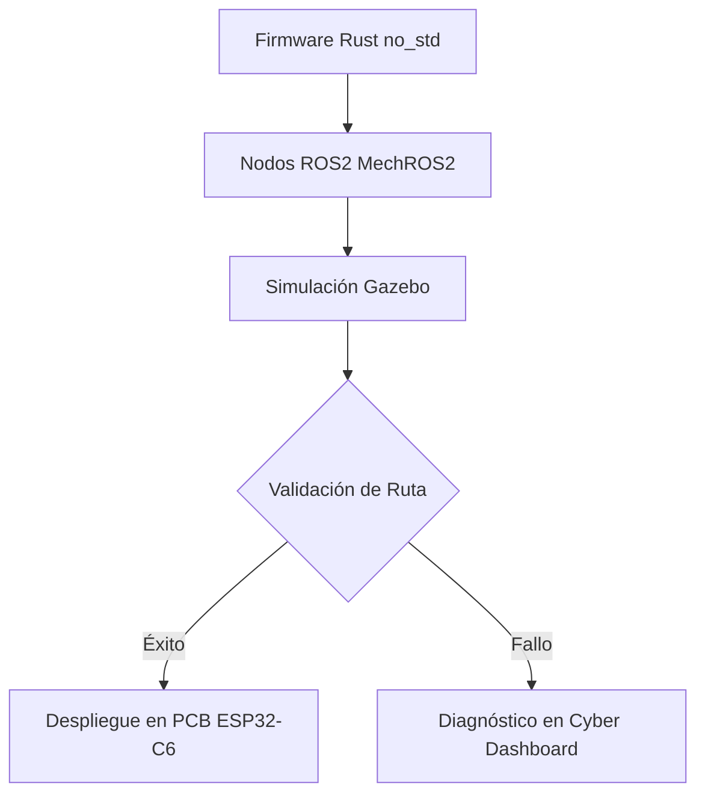

# Especificación Técnica del MechBot-2X

Este documento formaliza la arquitectura del robot, el firmware en Rust, las simulaciones y el flujo de automatización de documentación, adaptado a los requerimientos del ecosistema **MechMind-dwv** [1] [2].

## 1. Estructura de Activos de Robótica

La distribución de directorios para el desarrollo y diseño robótico se organiza de la siguiente manera:

```text
docs/robotics/
├── DATASHEET.md
├── README.md
├── firmware/
│   ├── README.md
│   └── src/
│       └── main.rs
└── api/
    ├── README.md
    ├── STRUCTURE.md
    ├── documentacion.md
    ├── rest/
    │   ├── examples.drawio
    │   └── sequenceDiagram.mmd
    └── schematics/
        ├── README.md
        ├── STRUCTURE.md
        ├── block-diagram.png
        ├── cocommunication-protocol.md
        ├── mechbot-architecture.drawio
        └── versiones/CHANGELOG.md
```

---

## 2. Componentes Clave

### 2.1. Ficha Técnica (`DATASHEET.md`)
La especificación de hardware del MechBot-2X comprende los siguientes parámetros principales:

| Parámetro | Valor |
|---|---|
| **CPU** | ESP32-C6 (RISC-V, arquitectura `no_std`) [1] |
| **Sistema Operativo** | ROS2 Humble / Micro-ROS |
| **Sensores** | LiDAR RPLidar A1, IMU I2C |
| **Lenguaje principal** | Rust con `portable_simd` [1] |


### 2.2. Firmware Embebidda (`firmware/src/main.rs`)
El firmware base utiliza abstracciones de hardware compatibles con entornos sin sistema operativo (`no_std`):

```rust
#![no_std]
#![no_main]

use core::panic::PanicInfo;

#[panic_handler]
fn panic(_info: &PanicInfo) -> ! {
    loop {}
}

#[no_mangle]
pub extern "C" fn main() -> ! {
    // Inicialización del lazo de control ROS2 serial y actuadores
    loop {}
}
```

### 2.3. Simulación en Gazebo (`simulations/gazebo/launch/`)
Para la validación virtual de trayectorias previas al despliegue en placa:

```xml
<!-- mechbot.launch.xml -->
<launch>
    <node pkg="gazebo_ros" type="spawn_model" name="spawn_mechbot"
          args="-urdf -model mechbot -param robot_description" />
</launch>
```

---

## 3. Generación de RustDoc con Nightly

Para compilar la documentación del workspace en entornos locales o de integración, se debe utilizar obligatoriamente el toolchain Nightly para satisfacer la característica de SIMD portable:

```bash
rustup toolchain install nightly
cargo +nightly doc --workspace --no-deps --document-private-items
```

El resultado se almacena en `target/doc/` y se publica automáticamente en GitHub Pages mediante el workflow [`../../.github/workflows/docs.yml`](../../.github/workflows/docs.yml) [1].

---

## 4. Diagrama de Arquitectura



---

## Referencias

[1] Repositorio oficial de MechMind-dwv: [https://github.com/mechmind-dwv/mechmind-dwv](https://github.com/mechmind-dwv/mechmind-dwv) [1]

[2] Documentación y especificaciones de arquitectura técnica en `./docs/architecture/` [2]
