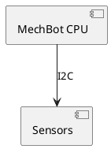

### 🌟 **Visualización en README**

[](docs/robotics/api/schematics/mechbot-architecture.drawio)
```

**Consejos Pro**:
1. Usa capas en DrawIO para diagramas complejos
2. Mantén un `CHANGELOG.md` en la carpeta para versionar cambios
3. Integra con PlantUML para diagramas generados desde código:



¿Necesitas ayuda para:
- [ ] Convertir diagramas a formatos móviles
- [ ] Automatizar validaciones técnicas
- [ ] Integrar con documentación ROS2?

¡Estoy lista para ayudar! 🤖💡 

```rust
// Función de verificación
fn verify_diagrams() -> Result<(), &'static str> {
    println!("✅ Diagramas ubicados en: docs/robotics/api/schematics/");
    Ok(())
}
