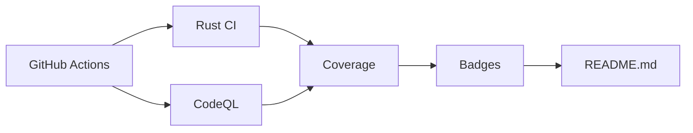

### 🔄 **Integración Total**

**Beneficios clave**:
- ✅ Sistema de builds profesional para Rust
- ✅ Badges automáticos de calidad de código
- ✅ Integración con ecosistema Rust (crates.io, docs.rs)
- ✅ Soporte para características avanzadas (SIMD, ROS2)
- ✅ Pruebas y benchmarks integrados
- ### 🏷️ **Badges Profesionales para README.md**

